# [애초에 npm부터 뭔지 모르겠다.](https://zenn.dev/antez/articles/a9d9d12178b7b2)

## 들어가기

역시 webpack이 뭔지 모르겠다[1](./2022-01-30-yappari-webpack-ga-wakaranai-episode1.md), [2](./2022-02-14-yappari-webpack-ga-wakaranai-episode2.md)를 공개했습니다만 애초에 npm 자체가 뭔지 모르겠다는 사람도 있기에 이번에는 npm에 대해 설명해보려합니다.

여전히 역시 webpaack이 모르겠기에 Vite를 다루고 있습니다만 Node.js도 새로운 런타임 Deno가 등장했습니다. 하지만 아직까지는 실무에서 사용하기는 어렵기에 Node.js를 사용하기 위해 npm은 제대로 이해하는 쪽이 좋겠죠

## npm이란


**npm**이란 Node.js 패키지 관리 시스템, 소위 패키지 관리 시스템입니다. 어플리케이션을 만들 때, 편리한 패키지를 그 프로젝트에 설치해서 사용할 수 있습니다.

그런데 패키지란 대체 뭘까요?

### 패키지란

시스템 개발에는 모듈, 패키지, 라이브러리 이런 단어들이 빈번하게 튀어 나오기에 여러분들도 들어본 적 있을 것이라 생각합니다. 이것은 프로그램 언어에 따라 의미가 다르기도 하기에 꽤 괴상한 존재입니다.

일반적으로 **모듈**은 다른 프로그램에서 이용하기 위한 목적인 클래스, 함수 등의 프로그램입니다. [역시 webpack이 뭔지 모르겠다 1](./2022-01-30-yappari-webpack-ga-wakaranai-episode1.md)에서도 설명했기에 이를 보신 분들은 이해가 더 명확할 것이라 생각합니다. 그리고 이 모듈을 모아서 기능하도록 하는 것이 패키지 혹은 라이브러리라 불립니다. 여기에 패키지 혹은 라이브러리로 모아둔 것을 이런 저런 명칭으로 불립니다. 괴상하죠.

여기까지 일반적인 이야기고, npm 자체적 정의가 있습니다.
우선 npm에는 라이브러리라는 단어가 없습니다. 머리에서 추방해 버리세요. npm에 존재하는 것은 패키지와 모듈 뿐입니다.
그리고 이 설명을 이 단계에서 하면 머리가 혼란스러울 수 있으니 우선은 npm 에서 다운로드해서 사용하는 것을 패키지라 여기면 좋겠습니다. 이에 대해서는 이 글의 [마지막](#패키지랑-모듈)에 설명하겠습니다.

### npm의 필요성

직접 패키지를 다운로드하면 되지 않나 싶기도 할 것입니다만 그럴 때는 여러 문제가 발생하기에 npm에서 관리할 필요가 있었습니다.

- **패키지 의존관계**
  패키지 x를 사용하기 위해서 y가 필요할 때, 패키지 x는 패키지 y에 의존한다 말합니다.그러나 어떤 패키지를 설치할 때마다 그 의존관계인 패키지를 설치해서 또 거기에 의존관계를 또 설치... 이러면 복잡해지겠죠
- **패키지 경합관계**
  패키지 x에 의해서 사용된 패키지 y가 지금부터 설치할 패키지 z에도 필요한 경우에 패키지 y를 또 설치해서 충돌하게됩니다. 이를 패키지 경합관계라 하며 어떤 패키지를 설치할 때 경합하는 패키지, 모듈이 없는가 알아둬야 합니다.

npm은 패키지를 관리해주면서 이런 문제들을 해결해줍니다.

### Yarn

`Yarn`은 npm보다 설치 속도가 빠르며, 보안성 높다는 특징 등이 있습니다. FaceBook(현 META)에서 개발한 패키지 관리 시스템이죠. npm과 호환성이 있어서 npm 설정 파일인 package.json을 사용할 수 있습니다. npm보다 Yarn를 추천하는 사람도 많지만 개인적으로는 개선되어진 npm으로도 충분하다 생각합니다. 사족으로 Facebook은 React 같은 것을 필두로 처음에는 편리하지만 중간에 괴상해진 시스템을 만드는 병이 있습니다.

> 역주 (여담으로 npm도 MS에서 인수했으니...)

### npm 설치

npm은 Node.js를 설치하면 동시에 설치됩니다. 그러니 지금 프론트엔드 개발은 Node.js 설치부터! 이렇게 말해도 과언이 아닙니다.

우선 npm 패키지 관리 시스템이라 말했지만, Node.js 자체도 **nvm(Node Version Manager)**으로 버전 관리 시스템으로 관리됩니다.
nvm 사용은 필수는 아니기에 그냥 Node.js를 설치해도 좋지만 Node.js는 버전 업이 빈번하기에 웬만하면 nvm로 관리하는게 좋겠죠. 이를 관리하면 Node.js 버전을 올리거나 되돌리거나 할 때도 간단합니다.

#### mac

mac의 경우 nodebrew 같은 것으로 관리할 수 있지만, 우리는 nvm를 설치하겠습니다.

그럼 예쁜 mac에서 최첨단 개발을 하기 위한 세례를 받아봅시다.
mac은 Catalina 이전과 이후가 다른 쉘을 씁니다. Catalina 전에는 bash, Catalina 부터는 zsh입니다.
뭔지 확인하려면 터미널에서 이 커멘드를 사용해보세요.

```bash
echo $SHELL
```

`/bin/zsh` 혹은 `/bin/bash`가 표시됩니다.
우선 zsh은 nvm은 업데이트 하기 위해 `.zshrc`를 사용하지만 이는 기본적으로 작성되어 있지 않습니다. 그러니 만들어 줍시다.

```bash
touch ~/.zshrc
```

다음은 bash인 경우입니다. 우선 `.bash_profile` 파일이 없는 경우가 있습니다. 확인해봅시다.

```bash
ls -a ~/ return
```

없다면 만듭시다.

```bash
touch ~/.bashrc
```

아직도 끝나지 않았습니다.
Xcode 커맨드라인이 설치되어 있지 않다면 설치합시다.

```bash
xcode-selct --install
```

이제서야 드디어 nvm 설치를 할 수 있습니다.
설치는 curl 혹은 wget 커맨드, 직접 다운로드 등으로 설치할 수 있지만 [nvm-sh](https://github.com/nvm-sh/nvm)를 확인해보고 설치합시다.

```bash
# curl
$ curl -o- https://raw.githubusercontent.com/nvm-sh/nvm/v0.39.1/install.sh | bash
# wget
$ wget -qO- https://raw.githubusercontent.com/nvm-sh/nvm/v0.39.1/install.sh | bash
```

우선 `command + q`로 터미널을 종료시키고 다시 터미널을 기동합시다. 혹은 source 커맨드를 실행해 변경사항을 반영해주세요.

```bash
source ~/.bash_profile return # bash
source ~/.zshrc #zsh
```

이제 버전을 확인합시다!

```bash
nvm -v
# 혹은
command -v nvm
```

### Linux

레일이 따로 없는 Linux는 mac 같이 굳이 설정을 따로 할 필요는 없습니다.
curl 커맨드 혹은 wget 커맨드로 설치합시다.

```bash
# curl
curl -o- https://raw.githubusercontent.com/nvm-sh/nvm/v0.39.1/install.sh | bash

# wget
wget -qO- https://raw.githubusercontent.com/nvm-sh/nvm/v0.39.1/install.sh | bash

```

이걸로 설치가 끝입니다.

설치하면 `.bashrc`에 새로운 것이 추가되었으니 `bash`를 다시 열어라 합니다.

```bash
=> Appending nvm source string to $HOME/.bashrc
=> Appending bash_completion source string to $HOME/.bashrc
=> Close and reopen your terminal to start using nvm or run the following to use it now:

export NVM_DIR="$HOME/.nvm"
[ -s "$NVM_DIR/nvm.sh" ] && \. "$NVM_DIR/nvm.sh"  # This loads nvm
[ -s "$NVM_DIR/bash_completion" ] && \. "$NVM_DIR/bash_completion"  # This loads nvm bash_completion
```

확인해봅시다.

```bash
tail -n 3 $HOME/.bashrc
export NVM_DIR="$HOME/.nvm"
[ -s "$NVM_DIR/nvm.sh" ] && \. "$NVM_DIR/nvm.sh"  # This loads nvm
[ -s "$NVM_DIR/bash_completion" ] && \. "$NVM_DIR/bash_completion"  # This loads nvm bash_completion
```

bash를 다시 열어 버전을 확인해봅시다.

```bash
nvm --version
```

### Windows

Windows에서 nvm은 주로 nvm-windows, nodist 2종류를 사용합니다. 기능면에서는 둘 다 크게 다르지 않습니다만, 여기서는 Linux의 nvm 커맨드와 비슷한 nvm-windows를 설치하려합니다. 설치는 [github](https://github.com/coreybutler/nvm-windows/releases)에서 설치 파일(nvm-setup.zip)을 다운로드해서 실행할 뿐입니다.

설치를 마치면 버전을 확인합시다.

```bash
nvm -v
```

## nvm 사용방법

버전 확인은 이런 식입니다.

```bash
nvm --version
# 또는
nvm -v
```

```bash
# 도움말
nvm --help
# 설치 가능한 Node.js 확인
nvm ls-remote
# nvm-windows에서는
nvm list available
```

최신 버전을 사용할 이유가 딱히 없고 백엔드 사용에서 조차 LTS 설치를 권장합니다. **LTS(Long Term Support)**는 적어도 18개월간은 지원과 관리가 있는 버전으로 [Release](https://github.com/nodejs/Release)에 스케쥴이 공개되어 있습니다.

코드네임은 Argon, Boron, Carbon, Dubnium ... 이렇게 버전업하고 있지만 가장 숫자가 큰 Last LTS:를 선택합시다.

설치할 때는 다음과 같이 버전을 지정합니다.

```bash
nvm instsall 16.13.2
```

32비트판이라면 따로 지정할 것이 있습니다.

```bash
nvm install 16.13.2 32
```

설치된 버전을 한 눈에 확인해봅시다.

```bash
nvm list
```

사용할 버전을 바꿔봅시다.

```bash
nvm use 12.19.0
```

볼 일 봤으니 삭제해야죠?

```bash
nvm uninstall 16.13.2 32
```

이것으로 Node.js 설치가 되는 동시에, npm도 설치가 끝냈습니다.

간단한 npm 명령어를 확인해봅시다.

```bash
# 버전 확인
npm -v
npm --version
npm version

# 도움말
npm help
npm --help
npm help 커맨드
npm -h 커맨드
```

## npm 사용방법

### 프로젝트 만들기

모두에서 설명했듯이 npm은 프로젝트 안에서 패키지를 관리하는 것이므로 우선 프로젝트를 만들 필요가 있습니다.
프로젝트를 만든다는 것이 엄청 대단한 일로 보이지만 요는 만드려는 어플리케이션 같은 것을 모아서 하나의 폴더에서 처리한다 입니다. 아무 곳에 폴더 하나 만듭시다.

만드셨나요? 그러면 그 안에 텅텅 비겠죠. 이 프로젝트 안에 어플리케이션을 만들어봅시다. 그리고 프로젝트를 npm으로 관리해봅시다.

#### 초기화

프로젝트를 npm으로 관리하기 위해 초기화합니다.
초기화라 하면 또 이거 뭐 대단한 일인가 싶지만 단지 프로젝트 관리 파일인 package.json를 만들 뿐입니다.
그래서 직접 손으로 적어도 별 상관없습니다.
또 이 초기화를 하지 않아도 패키지를 설치할 때 알아서 작성됩니다. 그러나 관리를 위해 초기화합시다.

```bash
npm init

package name　 # 패키지 이름
version        # 버전
description    # 버전 설명
entry point    # 메인 파일(제일 먼저 실행 될 파일)
test command   # scripts의 test에 설정할 커맨드
git repository #  git 레포지토리 URL
keywords       #  키워도, 패키지를 공개할 때 검색의 용이를 위함
author         #  저자
license        #  라이센스
```

```bash
# 나중에 설정해도 되므로 귀찮다면
npm init -y
```

이 과정이 끝났다면 package.json 내용이 가득 찼을 것입니다.

```json
{
  "name": "sample",
  "version": "1.0.0",
  "description": "",
  "main": "index.js",
  "scripts": {
    "test": "echo \"Error: no test specified\" && exit 1"
  },
  "author": "",
  "license": "ISC"
}
```

그럼 상세히 들여다보기 전에, 우선 대략적인 개괄을 알아봅시다.

##### proxy

빨리 프로젝트에 대해 설명하고 싶지만 그 전에 유의할 것이 proxy입니다.
개인적으로 사용할 때는 거의 없어보이지만 기업 내에서는 proxy를 포함하고 있을 경우가 있습니다.

다음 커맨드로 설정을 확인합시다.

```bash
npm config list

# 더 상세한 정보

npm config ls -l
```

proxy 경유하기 위해서는 다음과 같은 커맨드로 설정합니다.

```bash
npm config set proxy http://proxy.foo.com:8080

# 비밀번호가 필요하다면
npm config set proxy http://<ID>:<password>@proxy.foo.com:8080
```

SSL 관련 오류가 발생할 때는 registry를 https에서 http로 변경합시다.

```bash
npm config set registry http://registry.npmjs.org/
```

### 패키지 설치

패키지를 설치할 때, 현재 폴더에서 설치하는 **로컬 설치**와 사용하고 있는 컴퓨터 전체에서 사용하는 **전역 설치**이 있습니다.

```bash
npm install 패키지명
npm i 패키지명

# 버전지정
npm i 패키지명@x.y.z
```

전역 설치

```bash
npm i -g 패키지명
```

설치에는 다음과 같은 옵션이 있습니다.
dependencies 같은 세세한 설명은 [package-lock.json](#package-lock.json)에서 설명하겠습니다.

```bash
# package.json에 명시하지 않는다.
$ npm i --no-save 패키지명

# package.json dependencies에 등록
$ npm i --save 패키지명

# package.json optionalDependencies에 등록
$ npm i --save-optional 패키지명

# package.json devDependencies에 등록
$ npm i --save-dev 패키지명
$ npm i -D 패키지명
```

```bash
npm install
```

이렇게하면 최신 버전이 설치됩니다.
버전을 지정하고 싶은 경우에는 package-lock.json 파일을 사용합시다.

또한 npm 자신을 버전업 하기 위해서 패키지 설치와 같이 npm에서 자신을 설치하면 됩니다

```bash
npm i -g npm
```

### 패키지 목록

설치된 목록을 확인합시다.

```bash
# 설치된 패키지 목록
npm list
npm ls
npm la
npm ll
# 직접 설치한 패키지만 게시
npm list --depth=0
# 전역 설치한 패키지 일괄
npm list -g
```

설치할 수 있는 패키지를 검색해봅시다.

```bash
# npm 레포지토리에서 검색
npm search 패키지명

# 패키지 상세정보를 게시
npm info 패키지명
npm view 패키지명
npm show 패키지명

# 패키지 버전을 게시

npm info 패키지명 version # 최신 버전만
npm info 패키지명 verions # 설치 가능한 모든 버전
```

### 업데이트

패키지를 업데이트합시다.

```bash
# 업데이트 확인
npm outdated
npm outdated -g

# 업데이트
npm update 패키지명
npm update -g 패키지명

# 패키지명을 생략하면 package.json에 있는 모든 것을 업데이트합니다.
npm update
```

### npm-check-updates

**npm-check-updates** 패키지는 복수의 패키지를 업데이트할 때 편리합니다.

우선 설치합시다. 범용성이 높은 것이므로 전역설치하는 것이 좋겠지만, 로컬 설치하여도 좋습니다.

```bash
npm i -g npm-check-updates
```

다음 커맨드로 업데이트 정보를 확인할 수 있습니다.

```bash
ncu

# 게시의 예시
@types/react                  ^17.0.0  →  ^17.0.39
@types/react-dom              ^17.0.0  →  ^17.0.11
react-scripts                   4.0.3  →     5.0.0
typescript                     ^4.1.2  →    ^4.5.5

# 모든 패키지가 최신일 때는。
All dependencies match the latest package versions :)
```

예를 들어 상기한 typescript를 보면 현재 설치된 버전은 4.1.2인데 최신판은 4.5.5라는 걸 알 수 있습니다.
여기서는 표현되지 않지만 각 최신판에는 색이 붙어 있습니다. 그리고 그 색의 의미들은 이렇습니다.

- 빨강: 메이저 업그레이드
- 사이안: 마이너 업그레이드
- 초록: 패치 업그레이드

설치한 패키지가 많은 경우에는 패키지 별로 업데이트 정보를 볼 수 있습니다.

```bash
ncu 패키지명 # 특정 패키지만 볼 때
ncu -x 패키지명 # 지정한 패키지를 제외할 때

# 계속 패키지명을 적으면 여러 패키지를 지정할 수 있습니다.
ncu 패키지명 패키지명
ncu -x 패키지명 패키지명
```

이 업데이트 정보를 package.json에 반영하기 위한 커맨드

```bash
ncu -u
```

패키지를 지정하는 것으로 특정 패키지만을 업데이트할 수 있으며, 이어서 패키지를 지정하는 것으로 여러 패키지를 지정해 업데이트 할 수 있습니다.

```bash
ncu -u 패키지명
ncu -u 패키지명 패키지명 ...
```

특정 패키지를 제외하고 싶을 때

```bash
ncu -u -x 패키지명
```

또 이 커맨드들은 정규표현을 사용할 수 있습니다. 예를 들어서 앞머리가 react가 있는 패키지들의 업데이트 정보 봅시다.

```bash
ncu '/^react.*$/'
```

반대로 react가 붙어있는 모든 걸 제외합시다.

```bash
ncu -x '/^(?!react-).*$/'
```

이 외의 커맨드는 [깃허브](https://github.com/raineorshine/npm-check-updates) 확인할 수 있습니다.

### 삭제하기

설치를 배웠으니 삭제도 알아야겠죠.

```bash
npm uninstall 패키지 # 로컬
npm uninstall -g 패키지 -g # 전역

# 다양한 종류가 있습니다.
npm remove 패키지
npm rm 패키지
npm r 패키지
npm un 패키지
npm unlink 패키지
```

옵션을 붙이면 결과에 반영됩니다.

```bash
npm uninstall --save 패키지 # dependencies
npm uninstall --save-optional 패키지 # optionalDependencies
npm uninstall --save-dev 패키지 #devDependencies
```

## 지역 설치의 함정

많은 경우 보고 따라서 입력하는 경우 잦으므로 패키지가 동작하지 않을 때 곤혹스럽기도 합니다. 이는 결론부터 말씀드리면 로컬 설치했기에 PATH가 없을 수도 있기 때문입니다.

### PATH를 통한다.

PC에서 소프트웨어를 사용할 때 아이콘을 클릭하면 된다 생각하고는 하지만, 이 아이콘은 실행파일과 심볼릭 링크(바로가기)일 뿐입니다. **PATH**란 이 실행 파일 장소입니다. `/usr/bin/`이나 `C:\Neko` 같이 표현됩니다. 예를 들어 `C:\Program Files\nodejs\node.exe` 같은 실행파일을 지정하거나 실행파일이 있는 폴더를 지정하는 것으로 지정할 수 있습니다. 즉 아이콘을 클릭하는 설정하는 것이 PATH를 실행하는 것입니다. 아니면 직접 그 파일을 클릭함으로 실행할 수도 있겠지요.

본론으로 돌아가서 예를 들어 npm에서 webpack를 전역 설치함으로 `webpack`이 실행되며, 빌드됩니다.
하지만 신비롭게도 webpack의 PATH를 지정한 것도 아니고, webpack를 직접 실행할 것도 아닙니다.
그런데 왜 webpack이 실행되는 것일까요?
이는 OS가 그 커맨드의 장소를 지정하지 않아도 이 PATH를 찾으라는 목록을 가지고 있기 때문입니다. `webpack`를 실행하면 OS는 그 목록을 보여주며 목록에 적혀있는 PATH에 webpack이 있는가 없는가 찾아 봅니다.

수동으로 이 목록을 설정할 수 있으니 Node.js를 설치하면 자동적으로 설저됩니다. 이 처럼 PATH를 설정하는 것을 **PATH를 통한다**말합니다.
Node.js 설치한 시점에서 PATH를 통했으므로 바라던 곳까지 도달할 수 있게되어 `webpack` 커맨드로 실행할 수 있습니다.

전역 설치들은 어디에 설치되어 있는가 확인해보죠

```bash
npm root -g
```

패키지를 찾을 때마다 검색하는 PATH는 이렇게 하면 됩니다.

```bash
node -e "console.log(global.module.paths)"
```

npm의 설치 장소 확인

```bash
npm bin -g
```

환경변수에는 이것이 설정되어 있으며, 이 안에는 전역 설치된 각 패키지들의 실행파일이 있습니다.
이를 직접 실행하면 그 패키지를 실행하는 것입니다.

여담으로 Windows라면 "시스템 프로퍼티 > 환경변수"에 있는 path에서 설정 확인이 가능합니다.

### 전역 변수의 모듈

모듈에 관해 후에 설명하겠지만 요는 소스 코드 내의 읽혀지는(require()하는) 패키지라 생각하면 좋을 것입니다. 예를 들어 전역 설치한 패키지를 읽으려면

```js
const readlineSync = require('readline-sync');
```

이렇게하면 오류가 나옵니다.

```js
Error: Cannot find module 'readline-sync'
```

Node.js는 NODE_PATH라는 환경변수를 읽습니다. 이를 따라서 NODE_PATH에 이 패키지를 설정하지 않으면 안 됩니다.

우선은 PATH 설정하기 위해서 `node_modules`가 어디있는지부터 봅시다.

```bash
npm root -g
```

Windows라면 대체로 이런 위치일 것입니다.

```bash
C:\Program Files\nodejs\node_modules
```

NODE_PATH에 PATH를 추가하면 우선 `node` 커맨드를 쳐서 node모드를 킵시다.

```bash
node

Welcome to Node.js v14.18.1.
Type ".help" for more information.
>
```

패키지를 찾을 때 검색할 PATH를 봅시다. 아마 앞에서 확인한 것과 같겠지요

```node
global.module.paths;
```

`Ctrl + D`로 모드에서 빠져나옵시다.

이렇게 하면 NODE_PATH에 PATH를 지정합니다.

```bash
export NODE_PATH=<PATH>

# Windows
set NODE_PATH=<PATH>
```

확인해보면 PATH가 추가되었을 것입니다.

```bash
global.module.paths
```

우선 이것으로 PATH를 통할 수 있게 되었습니다.
하지만 되도록 로컬 설치합시다.

### 로컬 패키지 실행

문제는 로컬 설치입니다. 로컬 설치는 그 프로젝트 폴더 자체 내에 있는 `node_modules` 폴더에 설치됩니다.
실제 그 안을 들여다 봅시다. 1~2개 패키지 설치하는 것만으로도 무수히 많은 패키지가 설치됩니다. 이는 의존관계가 있는 패키지들도 같이 설치되기 때문입니다. 이 패키지들은 독자적 package.json를 가지고 관리됩니다.
그리고 로컬 설치는 PATH가 자동적으로 연결되지 않습니다.
직접 PATH를 지정해야합니다.
이 패키지 실행파일은 각 패키지의 `.bin` 폴더에 있으므로 여기를 지정합시다. `webpack`이라면

```shell
./node_modules/webpack/bin/webpack.js
```

하지만 실행할 때마다 이런 식이면 귀찮아 죽죠.
실은 `node_modules` 폴더에는 `.bin` 폴더가 따로 있어서 패키지에 의해서 실행 파일의 심볼릭 링크를 둡니다. 여담으로 **bin 커맨드**는 `./node_modules/.bin`으로 절대 경로를 반환합니다.

```bash
npm bin webpack
```

이렇게하면 실행할 수도 있습니다.

```bash
./node_modules/.bin/webpack
```

이것으로 PATH의 끝단에 있는 패키지만 바꾸면 끝입니다.
하지만 이건 즐거운 일이 아닙니다. 이것도 귀찮아 죽죠.
상세히 후술한 내용이지만 package.json의 scripts 필드를 설정하면 `npm run` 간단히 실행할 수 있습니다.

```json
// package.json
"scripts":{
  "webpack": "./node_modules/.bin/webpack"
},
```

```bash
npm run webpack
```

간단한 커맨드로 끝나므로 굉장히 편한 방법입니다. 단지 처음에 scripts 필드에 설정하는게 귀찮고, 관리가 번거로울 뿐입니다.

그럼 환경변수에 이 `/node_modules/.bin`를 추가하면 어떻게 될까요? `webpack` 커맨드가 실행됩니다. 다른 패키지를 설치했을 때도 같은 방식입니다. 그러나 프로젝트에 매번 환경변수를 설정하는 것은 OS 환경변수는 더럽혀집니다.

결국 뭘 해도 귀찮은 입력 작업은 벗어날 수 없습니다. 거기에 등장한 것이 npx 입니다.

### npx

npx은 앞에 설명한 `./node_modules/.bin`에서 커맨드를 찾아 실행합니다.

그것만으로도 편리하지만 우수한 점은 커맨드가 설치되지 않아도 그것을 임시 장소에 일시적으로 다운로드해서 실행, 처리를 마치면 삭제합니다. 그래서 환경을 오염시키지 않으면서 커맨드를 시도할 수 있습니다.

```bash
npx webpack
```

이는 꽤 좋은 방법입니다. 로컬로 설치된 패키지도 커맨드 앞에 npx를 붙이면 될 뿐입니다.

설치되지 않은 패키지의 커맨드를 일시적으로 다운로드한다 했지만, 여기에는 주의점이 있습니다. npm 레포지토리에서 찾는 것이므로 지정을 지정한 커맨드와 같은 이름의 패키지를 찾아야합니다. 실수로 커맨드를 입력할 때, 패키지명을 잘 못쓰면 찾을 수 없습니다. 이 때 `-p` 옵션으로 패키지명을 `-c` 옵션으로 커맨드를 지정할 수 있습니다.

```bash
npx -p express-generator -c "express -h"
```

역으로 말하면 이 커맨드가 유효한 패키지가 있으면 다운로드해 실행한다는 소리이므로 어찌보면 위험할 수도 있습니다...

또 일시적으로 설치는 npm 레포지토리 뿐만 아니라 Github, Gist에도 사용할 수 있습니다.

```bash
npx https://gist.github.com/레포지토리
```

여담으로 npm install도 가능합니다.

```bash
npm install https://gist.github.com/레포지토리
```

이것도 좋은 척하면서 악의를 숨긴 URL에 이용하게되면 엄청나게 위험한 놈입니다.

위험하다 했지만, 평범하게 사용할 때는 큰 문제가 없습니다. 일단 쫄지말고 사용해봅시다. 그러나 공식이 아닌 곳에서 `ctrl+CV` 하는 경우 당장 그만둡시다.

## package.json

드디어 package.json 설명할 차례입니다. **package.json**은 프로젝트의 구성, 구조를 보여주는 설계서 같은 것입니다.

여기서 민감한 분은 이 파일명에 위화감을 느낄 수도 있습니다. 프로젝트에 관해 적는 파일이라면 project.json 이어야하지 않나? package.json란 다운로드한 패키지를 설정하는 것이어야 하지 않나...? 실은 여기에는 이유가 있습니다. 프로젝트는 패키지이기도 합니다. 충격적인 사실인가요? 이에 대해서 설명을 하기 전에 package.json의 각 설정에 대해 설명하겠습니다. 프로젝트는 패키지이기도 하다는 사실을 염두하며 읽어주시길 바랍니다.

### name

패키지 이름입니다. 214 글자 이하로 이름을 붙일 수 있습니다.

후술할 내용이지만 npm은 패키지 레포지토리에서 다운로드하며 거기에 같은 이름인 패키지를 등록하는 것은 안 됩니다. 네이밍은 선착순입니다. 거기에 `@`, `/` 사이에 유저의 이름(혹은 조직명)을 넣어 표기하는 scoped packages 형식도 많습니다. `@types/react`, `@babel/core` 같은 것처럼요.

### version

패키지의 버전을 설정합니다. 버전의 기술 방법에는 법은 없습니다만 대체로 [유의적 버전 표기방법(Semver: Sementaic Versioning)](https://semver.org/lang/ko/)을 따릅니다. 이는 `3.12.1` 같이 3개의 숫자를 `.`를 넣어 잘라 표기하는 것입니다.

- 메이저 넘버
  제일 왼 편에 있는 것은 메이저 넘버입니다. 큰 변경, 흔히 말하는 메이저 업데이트가 있다면 이 숫자가 올라갑니다.

- 마이너 넘버
  중간에 있는 숫자는 마이너 넘버입니다. 새로운 기능이 추가될 때 숫자가 올라갑니다.

- 패치 넘버
  가장 오른 편에 있는 것은 패치 넘버입니다. 버그가 수정되면 숫자가 올라갑니다.

그래서 처음은 `1.0.0`입니다.

> 역주: 더글러스 크록포드는 JSON를 만들 때 숫자를 붙이지 않은 것을 다행이라 했습니다. JSON1이 있다면 언젠가 JSON2, 3... 이런게 생겨서 좋지 않았을 거라는 말과 함께요

### description

패키지를 설명하는 곳입니다. 알기 쉽게 설명문을 적어주세요. `npm search`에 보이는 것이므로 누군가 패키지를 찾을 때 도움이 됩니다.

### private

패키지를 공개하지 않는 설정입니다. 이를 `true`로 하면 패키지는 공개되지 않으며, 실수로 공개하지 않도록 개발 시에는 `true`로 하는게 좋겠죠.

### author

패키지 관리자를 설정합니다. 다음과 같은 형식이 많습니다.

```json
{ "author": "이름 <메@일> (git 주소)" }
```

### license

라이센스 정보입니다. 라이센스를 관해서 자세한 사항은 생략하지만 `MIT` 같은 것들입니다.

### homepage

패키지 홈페이지 URL를 표기하는 곳입니다.

### repository

패키지의 소스코드를 관리하는 곳을 설정합니다.

```json
"repository": {
  "type": "git",
  "url": "https://github.com/npm/~~~~~~~.git"
}
```

### bugs

패키지 버그에 관핸 URL이나 보고를 할 메일 서버를 설정합니다. GitHub Issue URL 설정하는 경우가 많습니다.

```json
"bugs": {
  "url":"https://github.com/npm/~~~~~~~/@#!@#!/issues",
  "email":"메@일",
}
```

### main

main은 각 패키지 설치 시에 시작점이 될 파일을 지정하는 곳입니다. HTML에서 index.html 같은거죠. 결국 패키지 자체를 공개하지 않는다면 큰 의미가 없습니다.

### bin

로컬 패키지 실행할 때 `./node_modules/.bin`에 심볼릭 링크를 둔다 했습니다만, 이것은 bin에서 설정한 내용을 심볼릭 링크로 만들어진다는 의미입니다. 패키지 자체를 공개하지 않는다면 이것도 큰 의미는 없습니다.

예를 들어, xyz 패키지에 다음과 같은 bin 설정이 있습니다.

```json
"bin": {
  "foo": "./aa/bb.js"
},
```

패키지를 설치하면 `./node_modules/.bin/foo`라 심볼릭 링크가 만들어집니다. 본체는 `./node_modules/xyz/aa/bb.js`가 됩니다. 또한, 기존에 같은 심볼릭 링크가 있다면 덮어쓰기 됩니다.

### scripts

로컬 설치 부분에서 사용했었는데 기억나시나요? scripts은 커맨더의 alias를 설정합니다.

```json
"scripts": {
  "webpack": "./node_modules/.bin/webpack",
}
```

이를 `npm run oo`로 실행합니다.

```bash
npm run webpack
```

실행하면 설정한 `./node_modules/.bin/webpack`이 실행됩니다. 이를 달리보면

```bash
./node_modules/.bin/webpack
```

이름는 자유롭게 설명할 수 있지만 `start`는 절대는 아니지만 통상 프로그램을 실행하는 커맨드를 설명해서 `npm start`로 실행할 수 있게 합니다.
또 `test`도 절대는 아니지만 통상 테스트할 때 쓰는 커맨드를 설명해서 `npm test`로 실행합니다.

또 앞머리에 **pre**를 붙이면 `pre`를 붙이지 않는 커맨드를 실행할 때, 반드시 `pre` 붙어있는 커맨드를 실행합니다. 예를 들어 다음과 같은 설명이 있다 칩니다.

```json
"scripts":{
  "prefoo": "./node_modules/.bin/aa",
  "foo": "./node_modules/.bin/bb",
}
```

이렇게 설정하면 `npm run foo` 커맨드 실행 시, 먼저 `prefoo`가 실행된 후에 `foo`가 실행됩니다.
그 다음 `post`가 있다면 `postfoo`가 실행되죠!

단지 패키지를 실행할 때는 npx를 사용하는 것이 좋겠습니다만 옵션 같은 것 때문에 길어진 커맨드는 scripts에서 설정해두는 편이 좋을 것입니다.

### dependencies

dependencies에는 그 패키지를 실행할 때 필요한 패키지를 설정합니다. `--save` 옵션을 붙여 설치하면 dependencies에 적힙니다.

> 역주: 개선된 npm에서는 `npm i 패키지명`으로 해도 그냥 자동적으로 dependencies에 포함됩니다.

```bash
npm i lodash
npm i --save ramda
npm i --save-dev underscore
# npm i -D로 하면 간단합니다.
```

```json
"dependencies": {
    "lodash": "^4.17.21",
    "ramda": "^0.28.0"
  },
  "devDependencies": {
    "underscore": "^1.13.2"
  }
```

npm install 부분에서 package.json에 설정된 패키지를 설치한다 설명했지만 이는 dependencies 다음에 나올 devDependencies 설정되는 패키지도 설치됩니다.

dependencies 또는 devDependencies에 설정된 패키지를 보면 `^`이나 `~`이 붙어 있습니다. 이는 `^`가 붙어있으면 메이버 넘버가 일치하는 것, 마이너 넘버와 패치 넘버는 설정되어진 것 이상이라는 의미이며, `~`가 붙어있으면 메이저 넘버와 마이너 넘버는 일치, 패치 넘버는 설정하는 것 이상이라는 뜻입니다.
또 `^`도 `~`도 붙어있지 않다면 모든 넘버가 일치하는 것을 뜻합니다. `npm install`를 실행하면 이 룰에 따라서 설치됩니다.
또 모든 넘버와 일치시키고 싶을 때에는 package-lock.json 사용해서 해결할 수 있습니다.

그럼 어째서 이렇게 번거로운 설정이 있을까요?
평범하게 최신 패키지를 설치하면 되는 거 아닌가 싶지만 이는 개발 현장에서는 자주 있는 일로, 관련하는 시스템이 버전을 올릴 때 그 시스템 자체가 정상적으로 기능하지 않을 수도 있기때문입니다. 예를 들어 메이저 업데이트 등에서 처리가 변경되는 경우 등입니다. 그래서 비교적 안심할 수 있는 마이너 넘버부터 설치하거나 버그가 수정된 패치 넘버만 설치합니다.

### devDependencies

devDependencies는 그 패키지를 실행하는 것과 관계없이 개발이나 테스트할 때 사용하는 패키지를 설정합니다. `--save-dev` 혹은 `-D` 옵션을 붙여서 설치하면 devDependencies에 적힙니다.

그 패키지를 공개해서 설치시킬 때, `npm install ****`으로 하면 devDependencies에 설정된 패키지는 설치되지 않습니다.
한 편 package.json에서 `npm install` 하는 경우는 dependencies랑 devDependencies에 설정된 모든 패키지를 설치합니다. 이는 `npm install --production` 옵션으로 devDependencies를 빼고 설치 할 수 있습니다.

### optionalDependencies

optionalDependencies에 설정한 패키지는 특정한 원인으로 설치를 실패해도 다른 설치 처리를 계속하게 합니다. 결국 딱히 없어도 문제가 일어나지 않는 패키지를 설정합니다. 여기서 설정하면 프로그램 내에 그 패키지가 없어도 문제없도록 코드를 작성할 필요가 있습니다. 그리고 애초에 그리 사용되지 않습니다.

## package-lock.json

package-lock.json은 패키지의 버전을 잠그는 파일입니다.
패키지를 `npm install`로 설치한 후에 `npm install`로 설치하면 갱신됩니다. 여기에는 의존관계한 패키지를 포함해서 다운로드한 모든 패키지의 버전과 정보가 관리됩니다.

예를 들어서 어떤 개발 프로젝트에 여러명의 개발자가 같이 하는 경우 모두가 개발 환경을 일치시키기 위해서 패키지의 버전도 모두 같아야합니다.
dependencies에서 설명한 `^`, `~`를 사용하면 될 것 같지만, 패키지에는 의존관계에 있는 패키지가 있기 마련이므로 그 패키지는 최신 버전이 설치됩니다.
그럼 표면상으로는 일치되는 것 같지만, 그 내부에 있는 패키지의 버전은 각기 다를 수도 있습니다. 대개 새롭게 설치한 사람은 버전이 새롭겠죠.

이 때 사용하는 것이 package-lock.json입니다. package-lock.json에는 다운로드 한 모든 패키지의 버전과 그 정보가 관리되므로 이를 이용해 설치하면 모든 패키지를 같은 버전으로 맞출 수 있습니다.

package-lock.json로 설치하려면 `npm install`를 사용하면 안 됩니다.

```bash
npm ci
```

`npm ci`로 설치하면 설정된 버전의 패키지를 설치됩니다. 당연히 package-lock.json은 갱신되지 않지요. 또 node_modules 안에 패키지를 전부 삭제해서 다시 설치하면 더 철저하게 환경을 일치시킬 수 있습니다.

## 패키지랑 모듈

패키지랑 모듈는 본래라면 초반에 설명해야 겠지만 기본적으로 꽤 괴상한 존재이자 package.json를 모르면 이해하기 어려운 놈이므로 이 타이밍에 설명하는 것이 좋을 것이라 생각했습니다.

npm에서 **모듈**은 node_modules 폴더에 존재해서 require() 함수로 읽혀서 사용되는 존재입니다. 단순하게 1개의 JavaScript 파일이 있어도 이에 해당되면 모듈이라 합니다. 대체로 package.json으로 관리되어 main 필드를 가지고 잇는 패키지, 혹은 그 내부에 읽혀져 사용되는 JavaScript 파일도 모듈이라 합니다.

npm에서 **패키지**는 package.json에서 관리되는 프로젝트를 지칭합니다. 예를 들어 프로젝트를 작성해 package.json를 설정한 프로그램을 작성하면 그것은 패키지라 합니다. package.json에서 프로젝트는 패키지이기도 하다 설명한 것이 바로 이 때문입니다.

한 번, 패키지를 다른 패키지에 설치한다 칩시다.
그 때, node_modules 안에 설치되는데, 설치된 것이 그 패키지에서 사용되는 것이라면 모듈이라 합니다.
그리고 그렇지 않은채 패키지 안에서 커맨드라인 등으로 개별적으로 사용된다면 그건 패키지입니다.

예를 들어 webpack 같은 것은 개별적 사용이므로 패키지가 되며, webpack에서 읽히고 있는 플러그인은 모듈입니다.

꽤 명쾌하지는 않지만 정리해보면

- 태초에는 모두 패키지이다.
- 패키지를 다른 패키지에 설치하면 사용방법에 따라서 패키지와 모듈로 나뉜다.
- 개별적 사용이면 패키지, 읽혀서 사용이면 모듈



또 모듈 안에 모듈을 읽어 사용되는 JavaScript이 있다면 그것도 모듈이라 합니다. 결국 node_modules 안에 있는, 읽혀서 사용되어 기능하는 파일 모두 모듈입니다.

## 패키지 공개

그럼 지금까지 설명에 따라 npm에서 패키지를 다운로드해 사용했지만 이 패키지는 대체 어디서 다운로드하는 것일까요?
그것은 npm Inc가 관리하는 [npmjs.com](https://www.npmjs.com/) 패키지 레포지토리에서 다운로드합니다.
유치해보이지만 이 서비스 자체도 npm입니다. 이것 때문에 혼란이 일 수 있으니 패키지 레포지토리는 npmjs라 부릅니다.

npmjs는 누구나 패키지를 등록할 수 있습니다. 이 글을 읽고 계신 당신도 지금 당장 등록할 수 있습니다. 그 만큼 무수한 패키지가 관리되어 있으나 취약성이나 악의가 담긴 패키지도 있기 마련입니다. 어디까지 신뢰할 수 있는가는 해당 기업이나 프로젝트에 따르지만 어느 정도는 안전성을 스스로 확인할 필요가 있습니다. 이런 부분 때문에 애초에 npm 자체를 사용하지 않는 기업도 있습니다. 의존성까지 확인하려면 답이 없기 때문이죠.

본론으로 돌아와 npmjs에 패키지를 공개해봅시다.

### 패키지 개발

간단한 패키지를 만들어봅시다.

우선 package.json을 만들어야겠죠.

```json
{
  "name": "motorcycles",
  "version": "1.0.0",
  "description": "Returns the name of your favorite motorcycle.",
  "main": "index.js",
  "scripts": {
    "choose": "node index.js"
  },
  "author": "저자(저자 URL)",
  "license": "MIT",
  "devDependencies": {
    "webpack": "^5.68.0",
    "webpack-cli": "^4.9.2"
  },
  "dependencies": {
    "readline-sync": "^1.4.10"
  }
}
```

webpack은 사용하지 않지만 devDependencies이 잘 작동하는지 확인차 설정했습니다. 이 패키지가 돌아갈 때는 `readline-sync` 패키지를 사용하므로 `npm i readline-sync`로 설치합시다.

만드려는 패키지는 뭐든 좋지만 우선은 현 폴더에 `index.js`를 작성합시다.

```js
// index.js
const readlineSync = require('readline-sync');

const motorcycles = ['CBX400F', 'XJ400', 'Z400FX', 'GS400'];
const index = readlineSync.keyInSelect(
  motorcycles,
  'Choose your favorite motorcycle.'
);

console.log(`You like ${motorcycles[index]}！`);
```

콘솔에서 바이크를 골라 보여주는 수준의 단순한 패키지입니다. package.json에 명시된 것처럼 `node index.js` 혹은 `npm run choose`를 통해 실행할 수 있습니다.

### 계정 생성

npmjs에 패키지를 공개하려면 [계정](https://www.npmjs.com/signup)을 만들어야 합니다.


입력을 다 하시고 `Create an Account`를 누르면 끝입니다.


입력한 메일에 일회성 비밀번호가 보내지므로 입력해주세요.

이러면 정말 계정 생성 끝입니다.

### 패키지 공개

패키지 폴더 안에서 npmjs에 로그인합시다.
유저명, 패스워드, 메일까지 적으면 또 다시 일회성 비밀번호가 보내지므로 확인해서 입력해주세요.

```bash
npm login
Username: <유저명>
Password: <패스워드>
Email: (this IS public)  <메일>
npm notice Please check your email for a one-time password (OTP)
Enter one-time password from your authenticator app: <일회성 비밀번호>
Logged in as **** on https://registry.npmjs.org/.
```

`npm publish` 커맨드로 공개합시다.

```bash
npm publish
npm notice
npm notice package: motorcycles@1.0.0
npm notice === Tarball Contents ===
npm notice 259B index.js
npm notice 48B  src/index.js
npm notice 50B  src/modules/module.js
npm notice 391B package.json
npm notice === Tarball Details ===
npm notice name:          motorcycles
npm notice version:       1.0.0
npm notice package size:  609 B
npm notice unpacked size: 748 B
npm notice shasum:        14d21f8b27b0eb608b05d297f6c7a8ba555fa326
npm notice integrity:     sha512-aII6oCp6ByOF1[...]ydy0/3LHZRLGg==
npm notice total files:   4
npm notice
+ motorcycles@1.0.0
```

이것으로 패키지 공개가 완료되었습니다. 로그아웃합시다.

```bash
npm logout
```

### 공개된 패키지 확인

정말 공개가 되었는지 확인합시다.
npmjs에서 확인할 수 있지만 커맨드로도 가능합니다.

```bash
npm search motorcycles
NAME                      | DESCRIPTION          | AUTHOR          | DATE       | VERSION  | KEYWORDS
motorcycles               | Returns the name of… | =*****          | 2022-02-07 | 1.0.0    |
```

공개된 것을 확인했습니다. 정보를 더 확인해보죠.

```bash
npm info motorcycles

motorcycles@1.0.0 | MIT | deps: 1 | versions: 1
Returns the name of your favorite motorcycle.

dist
.tarball: https://registry.npmjs.org/motorcycles/-/motorcycles-1.0.0.tgz
.shasum: 14d21f8b27b0eb608b05d297f6c7a8ba555fa326
.integrity: sha512-aII6oCp6ByOF1/mnRe5CN4ThfJQO8LC1QIs2G939xDCH+FfSZ0fM+nOz/0eeVKCmb9VQ2QFH6ydy0/3LHZRLGg==
.unpackedSize: 748 B

dependencies:
readline-sync: ^1.4.10

maintainers:
- 저자 <메일>

dist-tags:
latest: 1.0.0

published 12 minutes ago by 저자 <메일>
```

### 설치

공개가 잘 되었으니, 실제로 설치해봅시다.
새 폴더를 만들어서 설치해보죠.

```bash
npm init -y

npm install motorcycles
npm notice created a lockfile as package-lock.json. You should commit this file.
npm WARN test@1.0.0 No description
npm WARN test@1.0.0 No repository field.

+ motorcycles@1.0.0
added 2 packages from 2 contributors and audited 2 packages in 2.461s
found 0 vulnerabilities
```

잘 설치 되었네요. package.json도 한 번 확인합시다.

```json
{
  "name": "foo",
  "version": "1.0.0",
  "description": "",
  "main": "index.js",
  "scripts": {
    "test": "echo \"Error: no test specified\" && exit 1"
  },
  "keywords": [],
  "author": "",
  "license": "ISC",
  "dependencies": {
    "motorcycles": "^1.0.0"
  }
}
```

devDependencies에 등록한 webpack이나 webpack-cli은 설치되지 않았네요. dependencies에 motorcycles만 설정되어 있습니다. node_modules 폴더도 확인해보세요. 자기가 만들 패키지가 다운로드 되어 있습니다.

### 업데이트

그럼 업데이트를 해봅시다.
본래라면 소스코드도 좀 바꿔야겠지만, 일단은 package.json에서 버전만 올려봅시다.

```json
"version": "1.0.1",
```

package.json에서 버전을 올리지 않고 업로드하면 에러가 나올 수 있으니 주의하시길 바랍니다. 업데이트는 공개할 때와 같은 방법으로 npm login으로 로그인해서 npm publish로 업로드합니다.

```bash
npm login
...
npm publish
...
npm logout
npm search motorcycles
NAME                      | DESCRIPTION          | AUTHOR          | DATE       | VERSION  | KEYWORDS
motorcycles               | Returns the name of… | =*****          | 2022-02-07 | 1.0.1    |
```

### 패키지 삭제

올린 패키지를 삭제하고 싶다면 로그인해서 커맨드를 입력하면 됩니다.

```bash
npm unpublish 패키지명
```

다만 삭제하고 싶은 패키지명 + 버전은 다시는 등록할 수 없으니 유의하시길 바랍니다.

## 맺는말

npm은 Node Package Manager의 약자가 아니라 npm ls Not An acronym의 약자입니다. 이는 PHP: Hypertext Preprocessor, GNU's Not UNIX, YAML Ain't a Markup Language 같은 배크로님입니다.

글이 길어졌지만 마지막까지 읽어주셔서 감사합니다.
괜찮으시다면 [실무에 도움되는 중급자가 되기 위한 JavaScript 입문(문법편)](https://zenn.dev/antez/books/568dd4d86562a1)을 확인해주시면 좋겠습니다. 무료로 공개된 부분까지만 읽어도 좋으니까요.
