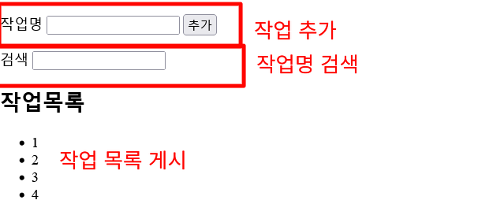

> [글](https://zenn.dev/nekoniki/articles/406087e43f4865)

## 머릿말

이번에는 `Recoil`에 대해 소개(+ 자신의 학습 메모)하려합니다.

`Recoil`은 `Facebook`이 개발한 `React`를 대상으로하는 **상태관리 전반을 다루는 라이브러리**입니다.

[이글](https://zenn.dev/catnose99/articles/zenn-dev-stack)에서도 다뤄고있지만 `Zenn`의 상태관리에도 사용하고 있는데다가, 지금 점유도 확대하고 있는 라이브러리입니다.

`JavaScript` 구현 예시는 종종 보이므로 이번에는 `TypeScript` 사용예시를 소개하겠습니다.

## 애초에 `Recoil`이 뭔죠?

구현하기 전에 먼저 `Recoil`에 대해 말해야겠죠.

`Recoil`은 `Facebook`이 2020년 5월에 발표한 상태관리 라이브러리입니다. [공식](https://recoiljs.org/)

비슷하게 상태관리하는 `Redux`가 나사하나 빠진 인상인데, 실제로 사용하면 꽤 별납니다.
지나칠 정도로 **데이터 스토어를 집약할 것인가 아닌가** 개념이 일반적 개념과 크게 다른 것이 시스템에 멋대로 반영된 이미지입니다.

또 `React Hook`와도 잘 어우러지면서 `useState` 같은 것을 사용하면서 `Functional Component + Hooks`를 바탕으로 개발했다면 금방 이해될 것이라 생각합니다.

**주의할 점은 현재는 아직 `Experimental` 레포지토리이므로 앞으로의 지원같은걸 고려해서 제품에 욱여넣는 건 아직 이르다 생각합니다.**

## 구현 샘플

구현한 앱의 샘플은 이러합니다.



흔히 보는 TODO 앱으로 작업 추가, 검색할 수 있습니다.

### 버전 정보

- react@17.0.1
- react-dom@17.0.1
- recoil@0.1.2

### 구현

다음과 같은 순서로 구현을 했습니다.

#### 프로젝트 만들기

```bash
npx create-react-app recoil-ts-sample --template typescript
cd recoil-ts-sample
```

#### Recoil 설치

```bash
yarn add recoil
```

#### types 작성

이 앱을 다룰 "작업" `type`를 만듭시다.
위치는 `src/types/Todo.ts`
간단하게 `title`만 갖는 `Todo`타입를 정의했습니다.

```ts
type Todo = {
  title: string;
};
export default Todo;
```

#### Atom 작성

이어서 `Atom` 작성
`Atom`은 `Recoil`에서 데이터저장소를 말하며 `atom()`이라 선언합니다.
`atom()`에는 `AtomOptions` 타입 오브젝트를 전달합니다.
`AtomOptions`는 아래와 같습니다.

```ts
// atom.d.ts
export interface AtomOptions<T> {
  key: NodeKey;
  default: RecoilValue<T> | Promise<T> | T;
  effects_UNSTABLE?: ReadonlyArray<AtomEffect<T>>;
  dangerouslyAllowMutability?: boolean;
}
```

`key`, `default`는 필수입니다.
`key`는 앱 전체에 영향을 끼치는 문자열, `default`는 `Atom` 역할로 상태관리 행하고 싶은 값 초기값입니다.

예를 들어 앱에서 "작업 목록"를 `Atom` 선언하면 다음과 같습니다.

```ts
// src/atoms/TodoListAtom.ts
import { atom } from 'recoil';
import Todo from '../types/Todo';

export const todoListState = atom<Todo[]>({
  // key는 "todoList"
  key: 'todoList',

  // 초기값으로 3건의 작업을 갖는 배열 선언
  default: [{ title: 'one' }, { title: 'two' }, { title: 'three' }],
});
```

상단에 "추가하고 싶은 작업명 필드", "검색문자열 필드" 상태인 `Atom`를 선언합시다.

```ts
// src/atome/TodoTitleFormAtom.ts
import { atom } from 'recoil';

export const todoTitleFormState = atom<string>({
  key: 'todoTitleForm',
  default: '',
});
```

```ts
// src/atoms/SearchTextFromAtom.ts
import { atom } from 'recoil';

export const searchTextFormState = atom<string>({
  key: 'searchTextForm',
  default: '',
});
```

`Atom` 선언은 `Redux`에서 `Store`라 생각하면 이해하기 쉬울지도 모르겠습니다.

#### Selector 작성

`Selctor`도 똑같이 작성합니다.
`Selctor`는 `Atom` 값을 사용해 어떤 계산이나 가공, 부작용을 처리해 결과를 반환하는 것입니다.

이번 앱에서는 "화면에 게시되는 작업목록"이 `Selector`를 사용합니다.
이는 화면에 게시되는 작업은 **[작업 전체]에서 [검색 필드에 입력된 문자]에 해당하는 문자를 포함하는 것을 보이기** 위함입니다.

`Selector` 선언은 `selector()`로 행합니다.
인수로 `ReadOnlySelectorOptions` 타입 객체를 전달해야합니다.
`ReadOnlySelectorOptions` 타입은 이렇습니다.

```ts
export interface ReadOnlySelectorOptions<T> {
  key: string;
  get: (opts: { get: GetRecoilValue }) => Promise<T> | RecoilValue<T> | T;
  dangerouslyAllowMutability?: boolean;
}
```

`Atom`처럼 `key`를 가지고 있습니다.
여기에 [어떻게 값을 얻을까] 정의하는 `get`도 있습니다.
`get`인수로 `GetRecoilValue` 타입의 `get`(프로퍼티 명이랑 같은게 좀 괴상하지만...)를 프로퍼티에 갖는 객체를 받는 함수입니다.

`Selector`를 사용하면 이렇게 됩니다.

```ts
// src/selectors/SearchedTodoListSelctor.ts
import { selector } from 'recoil';
import { todoListState } from '../atoms/TodoListAtom';
import { searchTextFormState } from '../atoms/SearchTextFormAtom';
import Todo from '../types/Todo';

export const searchedTodoListSelector = selector<Todo[]>({
  key: 'searchedTodoListSelector',
  // get은 { get }를 인수로 받는 함수
  get: ({ get }) => {
    // 인수 get를 사용해 Atom에서 최신 값의 받는다(작업 목록)
    const todoList: Todo[] = get(todoListState);
    // 똑같이 검색 필드 문자열 취득
    const searchText: string = get(searchTextFormState);
    // 검색 필드에 입력하는 경우 그 조건에 맞는 작업만 반환
    return searchText
      ? todoList.filter((t) => t.title.includes(searchText))
      : todoList;
  },
});
```

#### Root 선언

이것으로 `Recoil` 상태관리를 행하는 준비를 마쳤습니다.
`Recoil`로 상태관리 하기 위해서는 상태관리를 하고 싶은 각 장소를 `<RecoilRoot>`로 감싸야 합니다.
`Redux`에서 `<Provider>`로 감싸는 것과 같은 느낌입니다.

`index.tsx`안에 `RecoilRoot`를 사용해 `App`를 감쌉시다.

```ts
// index.tsx

import React from 'react';
import ReactDOM from 'react-dom';
import { RecoilRoot } from 'recoil';
import App from './App';

ReactDOM.render(
  <React.StrictMode>
    <RecoilRoot>
      <App />
    </RecoilRoot>
  </React.StrictMode>,
  document.getElementById('root')
);

/// ...후략
```

#### Atom, Selector에서 값을 얻기

그럼 컴포넌트 안에 `Atom`, `Selector`에게 값을 얻어봅시다.
값을 얻기 위해서는 `useRecoilValue()`를 사용합니다.
`useRecoilValue()`에는 `Atom`, `Selector`가 인수로 전달됩니다.
그 반환 값은 `Atom`, `Selector`가 최신 값으로 반환해주죠.

[작업 목록]을 게시하는 `TodoList.tsx`는 이렇게 됩니다.

```ts
// src/component/TodoList.tsx

import { useRecoilValue } from 'recoil';
import { searchedTodoListSelector } from '../selectors/SearchedTodoListSelector';
import Todo from '../types/Todo';

const TodoList: React.FC = () => {
  // useRecoilValue에 searchedTodoListSelctor를 전달
  // 반환 값은 searchedTodoListSelector의 get()으로 정의한 Todo[]
  const list: Todo[] = useRecoilValue(searchedTodoListSelector);
  return (
    <div>
      <p>작업 목록</p>
      <ul>
        {list.map((todo: Todo, i: number) => {
          return <li key={`${todo.title}_${i}`}>{todo.title}</li>;
        })}
      </ul>
    </div>
  );
};

export default TodoList;
```

#### `Atom` 값 변경

`Redux`에서 `Store` 값은 `Action`, `Dispatch`로 변경하면 참조하고 있는 컴포넌트에서 리렌더링합니다.
`Recoil`에서도 `Atom` 값을 변경하면 참조하고 있는 `Selector`나 컴포넌트에 자동반영됩니다.

`Atom` 값을 변경하기 위해서는 `useSetRecoilState()`에 `Atom` 값을 인수로 주면 됩니다.
반환 값으로 `SetterOrUpdater<T>` 타입 함수를 반환합니다.
이는 `Atom` 값에 대한 `Setter` 함수 같은 것으로 이 함수를 경유해 `Atom`를 갱신하면 앞에 재계산처리를 합니다.

예를 들어 [추가하는 작업명을 입력하는 필드] 컴포넌트 `TitleForm.tsx`는 이렇게 됩니다.

```ts
// src/component/TitleForm.tsx

import { useCallback } from 'react';
import { useRecoilValue, useSetRecoilState, SetterOrUpdater } from 'recoil';
import { todoTitleFormState } from '../atoms/TodoTitleFormAtom';

const TitleForm: React.FC = () => {
  // useRecoilValue로 todoTitleFormState 얻기

  const todoTitleFormValue: string = useRecoilValue(todoTitleFormState);
  // useSetRecoilState로 todoTitleFormState의 값을 갱신하는 Setter 함수 얻기

  const setTodoTitleFormValue: SetterOrUpdater<string> =
    useSetRecoilState(todoTitleFormState);
  // 텍스트 필드 onChange 처리
  const onChange = useCallback(
    (event: React.ChangeEvent<HTMLInputElement>) => {
      // 앞에 얻은 setTodoTitleFormValue에 갱신하고 싶은 새 값 전달 실행
      setTodoTitleFormValue(event.target.value);
    },
    [setTodoTitleFormValue]
  );

  return (
    <label>
      작업명:
      <input
        type="text"
        value={todoTitleFormValue}
        onChange={onChange}
        name="title"
        style={{ margin: 12 }}
      />
    </label>
  );
};

export default TitleForm;
```

똑같이 [문자열 입력하는 필드] 컴포넌트도 만들어 둡시다.

```ts
// src/component/SearchForm.ts

import { useCallback } from 'react';
import { useRecoilValue, useSetRecoilState, SetterOrUpdater } from 'recoil';
import { searchTextFormState } from '../atoms/SearchTextFormAtom';

const SearchForm: React.FC = () => {
  const searchTextFormValue: string = useRecoilValue(searchTextFormState);
  const setSearchTextFormValue: SetterOrUpdater<string> =
    useSetRecoilState(searchTextFormState);
  const onChange = useCallback(
    (event: React.ChangeEvent<HTMLInputElement>) => {
      setSearchTextFormValue(event.target.value);
    },
    [setSearchTextFormValue]
  );

  return (
    <label>
      검색:
      <input
        type="text"
        value={searchTextFormValue}
        onChange={onChange}
        name="title"
        style={{ margin: 12 }}
      />
    </label>
  );
};

export default SearchForm;
```

[작업 추가] 버튼 컴포넌트도요

```ts
// src/component/AddButton.tsx

import { useCallback } from 'react';
import { useRecoilValue, useSetRecoilState, SetterOrUpdater } from 'recoil';
import { todoTitleFormState } from '../atoms/TodoTitleFormAtom';
import { todoListState } from '../atoms/TodoListAtom';
import Todo from '../types/Todo';

const AddButton: React.FC = () => {
  const todoList: Todo[] = useRecoilValue(todoListState);
  const todoTitleFormValue: string = useRecoilValue(todoTitleFormState);
  const setTodoList: SetterOrUpdater<Todo[]> = useSetRecoilState(todoListState);
  const setTitleFormValue: SetterOrUpdater<string> =
    useSetRecoilState(todoTitleFormState);

  const onClick = useCallback(() => {
    setTodoList([...todoList, { title: todoTitleFormValue }]);
    // 작업을 추가 후 입력란 비우기
    setTitleFormValue('');
  }, [todoList, todoTitleFormValue, setTodoList, setTitleFormValue]);

  return <button onClick={onClick}>추가</button>;
};

export default AddButton;
```

#### App 수정

필요한 컴포넌트을 완성했습니다.
`App.tsx`를 수정해서 `Recoil`를 사용하는 컴포넌트를 사용합시다.

```ts
// App.tsx
import './App.css';
import TitleForm from './component/TitleForm';
import AddButton from './component/AddButton';
import TodoList from './component/TodoList';
import SearchForm from './component/SearchForm';

const App: React.FC = () => {
  return (
    <div style={{ margin: 12 }}>
      <div>
        <TitleForm />
        <AddButton />
      </div>
      <SearchForm />
      <TodoList />
    </div>
  );
};

export default App;
```

```bash
yarn start
```

### 이번에 만든 것

위의 소스는 `GitHub`에 [공개](https://github.com/ShutoYamada/recoil-ts-sample)되어있습니다.
잘 동작하지 않는다면 참조해주시길 바랍니다.

### 맺음말

`Recoil`에 대해 `TypeScript`를 사용한 간단한 ToDo 앱을 소개했습니다.
보통은 `Redux`를 사용해 개발하지만 `Recoil`이 더 간결하면서 직관적이므로 이해가 더 좋습니다.

또 `Hooks` 비슷한 느낌이므로 이것이 강점이 될 것 같습니다.

아직 `Experimental`이므로 앞으로 사용하는 감각이나 지원이 크게 변할 가는ㅇ성도 있지만 개인적으로는 더 점유가 많아졌으면 하면 유익한 라이브러리입니다.
