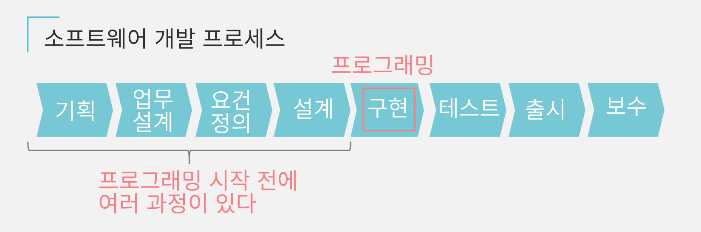

# [요건정의 ~ 시스템 설계까지 할 수 있는 인재가 되는 글](https://qiita.com/Saku731/items/741fcf0f40dd989ee4f8)

## 첫 머리

프로그래밍을 공부하고, 이런 걸 느낀 경험은 없나요

**공부해도 제품을 못 만든다**
**애초에 개발은 어떻게하지?**
**요건정의가 뭐지?**

이런 고민을 해결하기 위해, 우선은 **개발의 전체상**을 이해합시다.

소프트웨어 개발 프로세스를 확인보죠

늘 공부하는 프로그래밍은 "**구현**" 부분에 해결하겠네요
즉, 프로그래밍 실력을 발휘하기 전에 **4개의 벽이 있다는 거죠**

그래서 이 글에서는 구현(프로그래밍)을 시작하기 전에 필요한 **기획 ~ 설계**에 대해 설명하려합니다.

특히 엔지니어가 이해해야 하는 **요건정의**, **설계**에 초점을 두고 있습니다.

또 개발 전체에 대한 **구현(프로그래밍에 사용하는 시간은 전체의 20~30%라 합니다**
**반면 요건정의, 설계 등을 쓰는 것은 50%** 사용합니다.

즉, **요건정의, 설계가 되는 인재는 개발 프로젝트에 공헌도가 필연적으로 높다**는 의미입니다

이 계기로 제대로 몸에 익혀 활약의 장을 넓힙시다.

본 글의 구성

- 요건정의 필요성
- 요건정의를 결정하는 프로세스
- 요건정의에서 결정하는 사항
- 기본설계 제작방법
- 기본설계 그 넘어
- 정리

@SNS에서 여러 정보를 발신하고 있습니다. 글이 마음에 드셨다면 [twitter](https://twitter.com/digisaku710) 팔로우 해주시면 기쁠 것 같습니다.

## 요건정의 필요성

#### 요건정의 목적

시스템 개발 안건에는 크게 2개 종류 관계자가 있습니다.

- **시스템을 "만드는" 사람(개발자)**
- **시스템을 "사용하는" 사람(발주자)**

바라는 시스템을 자신이 만든다면, 머리 안에 완성된
이미지가 문제없지만, "발주자 => 개발자" 이런 부탁 형태 발주한 경우가 많겠을 것입니다.

그 때, **발주자 머리 안에 있는 이미지를 명확화**하지 않으면 개발자는 무엇을 만들어야 좋을지 모릅니다.

그러기 위해 소통하는 것이 요건정의입니다.

일상적인 예시를 들어봅시다.
목이 말랐을 때 "마실거 사줘!" 이런 부탁하나요?

"커피 사줘" 이런식으로 더 구체적으로

"**저당 커피 뜨거운거 사줘, 캔 말고 페트병으로 된거로**"

이렇게 표현하지 않으면 생각한대로 커피를 사오지 않을지도 모릅니다.

시스템 개발도 같습니다

"**뭘 어떻게 만들어야 만족스럽나요?**

이를 명확히 합의하는 것이 요건정의 목적입니다.

즉,

**요건정의 = 납품시 "이걸로 OK죠?"라 구체적인 확인하는 사전 약속**

이런 의미입니다.

## 요건정의를 결정하는 프로세스

요건정의 목적을 알았다면, 요건정의가 완성하기까지 3단계를 이해합시다

- **요망**: "이런 시스템이 있으면 좋겠다" 아이디어
- **요구**: 시스템에 구현하고 싶은 "대략적 기능 목록"
- **요건**: 쌍방이 합의한 **구체적인 기능 목록**이랑 **구현방법**

이 3단계의 과정에는 "**검토**", "**제안**"를 통한 커뮤니케이션이 필요하다.

순서대로 정리하면 이런 모양입니다.

1. **요망: 해결해야할 과제 (발주자 과제)**

   - 현재 과제
   - 골 (최종적인 상태)
   - 현재과 골 (해결해야할 과제)

2. **요구: 시스템에 구현하고 싶은 기능 (발주자 과제)**

   - 기획의 배경 (해결해야할 과제)
   - 과제해결에 필요한 시스템 개요
   - 구체적으로 구현하고 싶은 기능 목록

3. **검토: 요구 실현성을 생각한다 (개발자 과제)**

   - 기술적으로 가능한가?
   - 예산은 어느 정도인가?
   - 납기는 언제까지인가?

4. **제안: 검토한 결과를 발주자에게 제안 (개발자 과제)**

   - 구현할 수 있는 기능
   - 청구 금액
   - 납품하는 기일

5. **요건: 쌍방이 합의한 결정사항 (발주자 / 개발자 협력으로 결정)**
   - 시스템에 구현하는 기능 목록
   - 납기, 청구액 상세히 기술할 필요도 있습니다.

## 요건정의로 결정하는 사항

흐름을 알았으니, 여기까지 요건정의로 결정할 사항을 대략적 정리를 하겠습니다.

3W (Why / What / How)로 정리하는 것이 깔끔합니다.

- **Why: 시스템개발의 목적 (요망)**
  - 현재 과제
  - 골 (최종적인 상태)
  - 현재과 골 (해결해야할 과제)
- **What: 어떤 식으로 과제 해결하는가**
  - 시스템 도입 후 업무 흐름
  - 기능요건
    - 시스템에 구현하는 기능 목록
  - 비기능요건
    - 처리 스피드, 보안 등등
- **How: 구체적으로 사용하는 수단과 구현방법 (시스템 설계에 가까운 업무)**
  - 기본설계
    - 화면설계 (UI설계)
    - 기능설계
    - 데이터 설계
  - 상세설계
    - 클래스 관계도, 시퀀스 관계도
    - 시스템 아키텍처
    - 각 부위를 구현하는 기술 등등

## 기본설계(화면설계, 기능설계, 데이터 설계)의 작성방법

요건정의에서 결정된 사항이 많을 것이라 생각하실 수도 있지만 안심해주세요.

What (업무 흐름이나 기능요건, 비기능요건)은 엔지니어가 아닐가, 개발 중에도 "**영업맨**", "**세일즈 엔지니어**" 대응해주는게 보통입니다.

그러니 **엔지니어인 여러분은 능력을 발휘하는 HOW(설계)에 대해 깊게 연구할 수 있습니다.**

**그중에서도 특히 기본설계는 키를 쥐고있습니다.**

이글에서는 거기에 집중합니다.

전술했던데로 기본설계에는 "**화면, 기능, 데이터**"를 설계합니다.

이를 모았으니 이제 프로그래머가 소프트웨어 개발에 착수할 수 있습니다.

- 화면설계 (UI설계)

  - 각 화면에 뭘 할 수 있는가?
  - 게시하는 정보(문자, 이미지 등), 레이아웃
  - 상기한 것을 화면 transition 관계도로 정리

- 기능설계

  - 뒤에서 처리 (기능명, 처리내용)
  - 처리에 필요한 데이터, 데이터 취득처 (화면에서 입력, DB에서 취득 등)
  - 취득 한 데이터 전달처 (화면게시, DB 보존 등)

- 데이터 설계

  - 데이터의 구체적인 내용
  - 데이터베이스 설계
  - 데이터 흐름 (데이터 플로우)

## 화면설계 (UI설계)

우선 무엇보다 먼저 해야할 요소는 **화면설계 (UI 설계)**입니다.

유저는 화면(UI)을 통해 소프트웨어를 이용하므로, 먼저 "**화면의 사용하기 쉬움**"에 동의를 얻는 일이 프로젝트 성공의 지름길입니다.

화면설계에는 이런 항목을 결정합니다.

- 각 화면에 뭘 할 수 있는가?
- 게시하는 정보(문자, 이미지 등), 레이아웃
- 상기한 것을 화면 transition 관계도로 정리

여기까지 정리하면 시스템 완성도가 구체적으로 이미지되겠네요.

이게 가장 먼저 화면설계를 하는 이유입니다.

## 기능설계

화면설계 (UI설계)가 끝났으면, 시스템에 구현하는 기능을 설계합니다.

기능설계는 "**뒤에서 실행하는 처리, 필요한 데이터**"를 결정하는 페이즈라 이해해주세요.

필요한 결정사항

- 뒤에서 처리 (기능명, 처리내용)
- 처리에 필요한 데이터, 데이터 취득처 (화면에서 입력, DB에서 취득 등)
- 취득 한 데이터 전달처 (화면게시, DB 보존 등)

화면 transition 관계도에 등장한 각 페이지에 대해 대략적으로 기능 설계합시다.

이렇게하면 누가봐도, **어떤 프로그램을 만들어야 하는가** 이미지가 잡힙니다.

시스템을 구성하는 파츠 구성도 명확해지므로, **팀 안에 분할분담**도 간단하겠죠.

기능설계 마무리로 화면설계과 기능설계 이어봅시다.

화면 끼리 어떻게 해야 **유저조작 / 뒤에서 처리**가 일어나는가 가시화합니다.

전체를 정리하면 이렇겠죠.
@여기까지 오면 정보량이 많아지므로 자세히 보시려면 확대해서 봐주세요.

## 데이터 설계

마지막은 데이터 설계입니다.

여기까지 준비했으니, 이제 드디어 데이터 설계가 시작됩니다.

- 데이터의 구체적인 내용
- 데이터베이스 설계
- 데이터 흐름 (데이터 플로우)

여기까지 의식하고 있으면 좋은 것은 **데이터는 크게 나눠 4종류**라는 점입니다.

여기서 4종류 데이터가 시스템 안에 어떻게 흘러가는지 설계합시다.

- 프로그램에 "입력하는" 데이터(인수)

  - Web 화면에서 유저가 입력하는 데이터
  - 데이터베이스에서 읽는 데이터

- 프로그램에서 "돌아오는" 데이터(반환값)
  - Web 화면에 게시되는 데이터
  - 데이터베이스에 저장하는 데이터

## 데이터의 구체적인 내부

이 단계에서 "**회원정보**" 등 추상화해둔 데이터 정의를 구체화합니다.

또, 실무 레벨이 되면 "**정규화**" 지식이 필요합니다.
@정규화에 대해서는 [여기](https://qiita.com/mochichoco/items/2904384b2856db2bf46c)를 참조부탁드립니다.

- 회원정보

  - 이름
  - 영문이름
  - 메일주소
  - 비밀번호

- 상품정보

  - 상품명
  - 상세설명
  - 상품 이미지 URL
  - 장르
  - 메이커
  - 가격
  - 평가

- 구매이력
  - 회원 ID
  - 상품 ID
  - 구입일
  - 구입수량

## 데이터베이스 설계

데이터 내부가 명확해졌으면 데이터베이스를 설계합니다

우선 염두해둘 것은, 지금까지 데이터를 "회원정보", "상품정보", "구매이력"으로 불렀지만

데이터베이스 관점에서는 제대로 된 표현인 **테이블**이 있습니다.

@ "**회원 테이블**", "**상품 테이블**", "**구매이력 테이블**" 이런식이죠

데이터베이스 설계에 필요한 작업은 셋입니다.

- 테이블 역할을 "**마스터**"와 "**이력**"으로 구분한다
- 테이블 사이의 **참조관계** 정리
- 참조관계를 **ER관계도**로 그려둔다

@ (주의) "마스터", "이력"은 필자의 독자 관점입니다.

우선 이하의 기본으로 각 테이블 분할을 합시다

- 마스터: 기초정보(다른 데이블에서 참조하는 데이터)

  - 회원 테이블 (이후 "회원 마스터")
  - 상품 테이블 (이후 "상품 마스터")

- 이력: 시스템에 이용하는 안에 축적되는 데이터
  - 구매이력 테이블

계속해서 "테이블 사이에 참조관계"는 **참조처 - 참조처** 관계를 화살표로 정리한다.

**유저의 행동으로 인해 생기는 데이터**도 명기하면 데이터 흐름에 빈틈이 없어 이해하기 쉽습니다.

@기상 API라면 네트워크를 통해 외부에서 데이터를 호출하는 경우도 있습니다.

마지막으로 데이터베이스의 설계도가 되는 ER관계도를 만들면 완성입니다.
@ER관계도의 상세한 서술 방법은 [여기](https://it-koala.com/entity-relationship-diagram-1897)를 참조해주세요.

## 데이터 흐름 (데이터 플로)

마지막에 "**데이터베이스와 화면 transition 관계도**"를 정리하면,

시스템 전체상 "**화면설계 x 기능설계 x 데이터 설계**"가 보입니다.

이 설계도를 기본으로 하나 하나 프로그램을 적으므로, 계속 연습해서 제대로 된 전체상을 그릴 수 있도록 합시다.

## 기본설계 그 넘어

여기까지 이해하면 기본설계가 되었으므로, 자신의 제품 개발하는 목적만 있으면 됩니다.

모르는 부분은 이것저것 조사해 프로그래밍을 진행합시다.

개발 후, 서비스를 공개하기 위한 가짜 서버 설정은 많은 분이 Qiita에 글을 올려주셨으니, 이해하기 쉬운 것으로 [여길](https://qiita.com/tachibanayu24/items/b8d73cdfd4cbd42c5b1d) 참조해주세요.

또, 실제 개발환경에는 **상세 설계**까지 만들지 않으면 프로그래머에게 명확한 의뢰를 할 수 없습니다.

본 글의 내용을 제대로 이해한 후, 우선 이런 공부를 해보세요.

- 클래스 관계도, 시퀀스 관계도를 그린다
- 시스템 아키텍처를 결정한다
- 아키텍처 각 부위의 구현기술을 결정한다

그러나 이렇게 말해도, 최근은 특히나 기술혁신이 빠르기에 **상세설계하는 도중에 신기술이 등장하는** 경우도 있습니다.
애자일 개발을 배워 **상세설계는 만들며 결정**하는 것이 좋습니다.

@사내 개발방침에 따르는 것도 좋습니다.

## 맺음말

팀 개발 현장에서는 **역할분담가 기본전제**입니다.
제대로 전체상을 그리고 "**누가, 뭐를 만드는가**"를 명확히 해서 부드럽게 개발을 진행합시다.

또 SNS에도 여러 정보를 발신하고 있으므로 글을 읽고 좋다 느꼈다면 [twitter](https://twitter.com/digisaku710)를 팔로우해주시면 감사합니다.

(추가)

Python으로 시스템 설계하기 위해 필요한 스킬을 정리한 글을 적었습니다.

부디, 프로그래밍에 관심있다면 참조해주세요

- 시스템 개발에 필요한 스킬의 전체상: [Python에서 제로부터 서비스 개발, 공개하는 학습 로드맵](https://qiita.com/Saku731/items/52a3bbacd002f26f408e)
- Django를 사용한 시스템 개발 수순: [Django(Python)으로 시스템 개발할 수 있는 글 (입문편)](https://qiita.com/Saku731/items/ed64190a12a4498b9446)

@바라시는 분이 계셔서 Udemy 해설영상을 만들었습니다.
@선착 50명까지는 무료 쿠폰이 있으니 활용해주세요
(부디 좋은 평가 부탁드립니다 m(\_\_)m)
https://www.udemy.com/course/digisaku_requirements_definition_and_system_design/?couponCode=5B6F70B33E1FB0791B12
